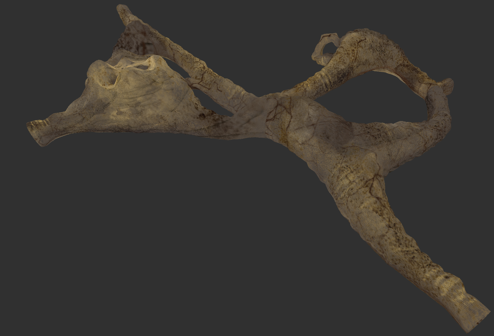
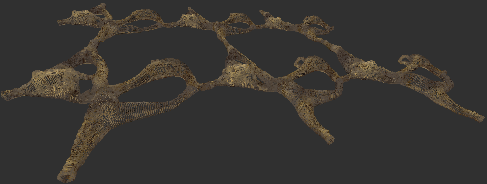
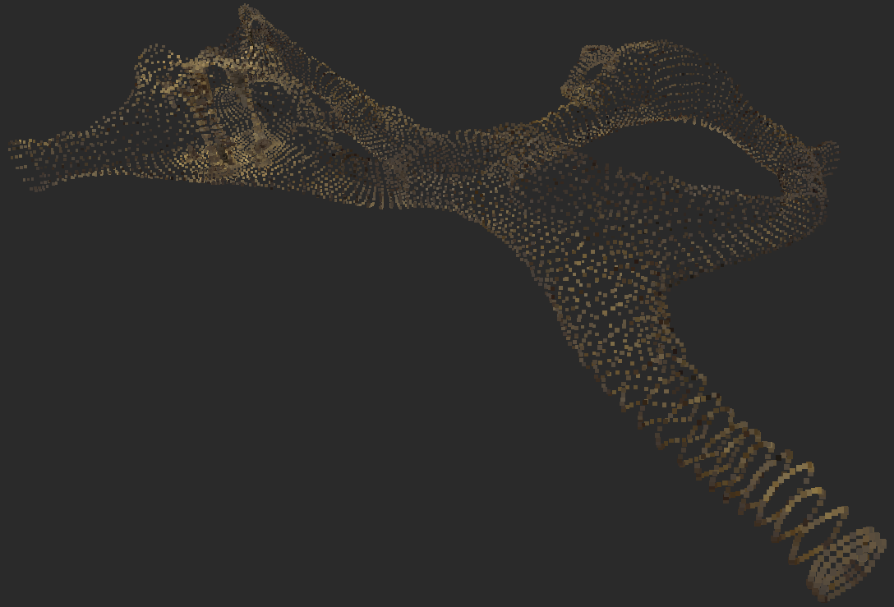
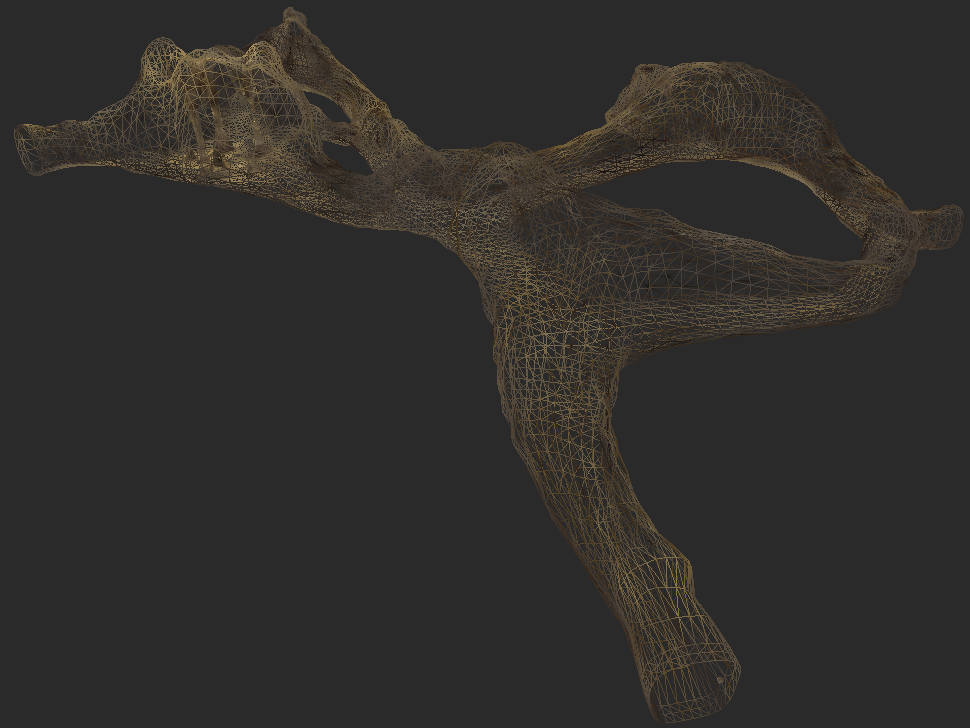
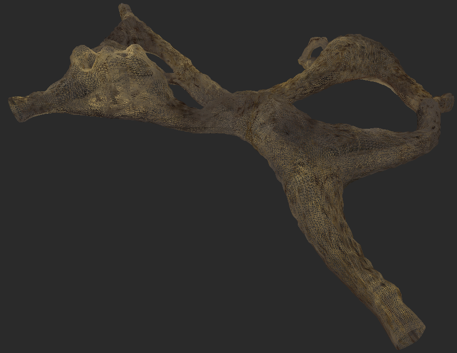
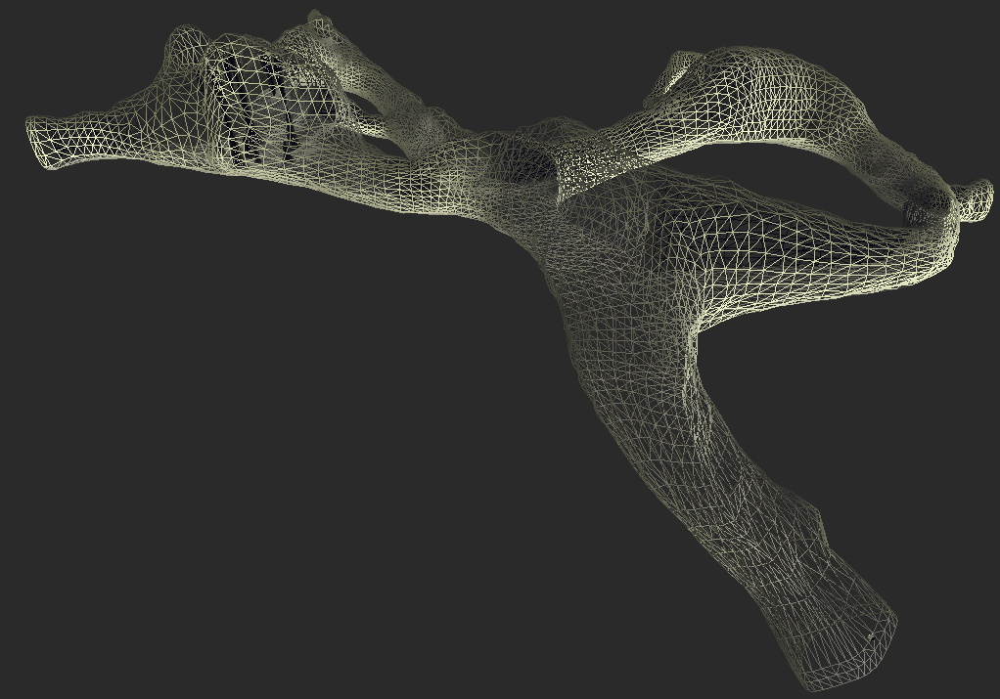
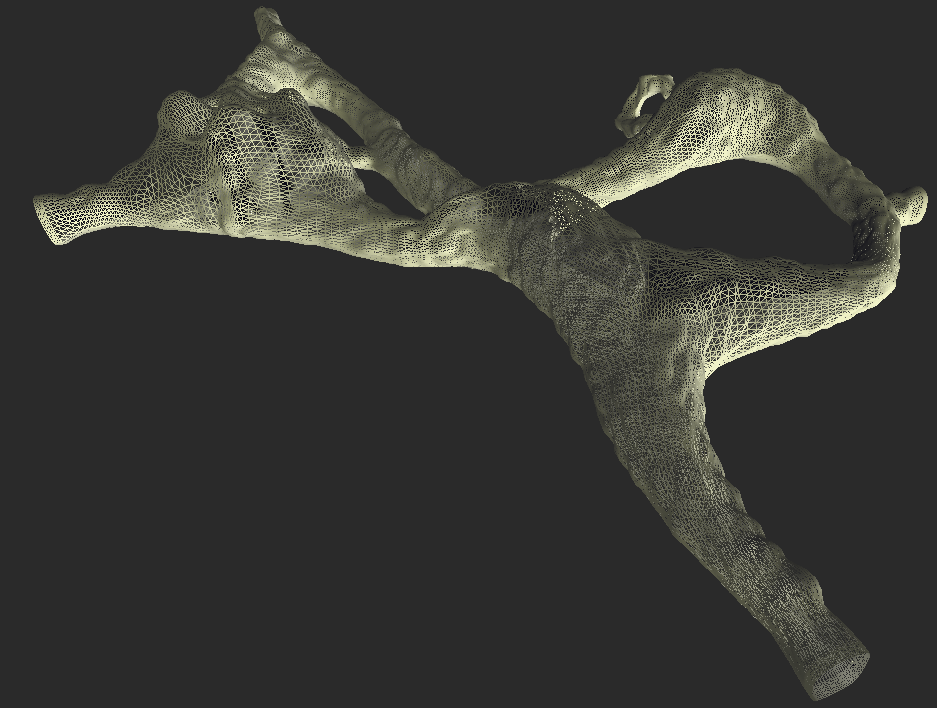
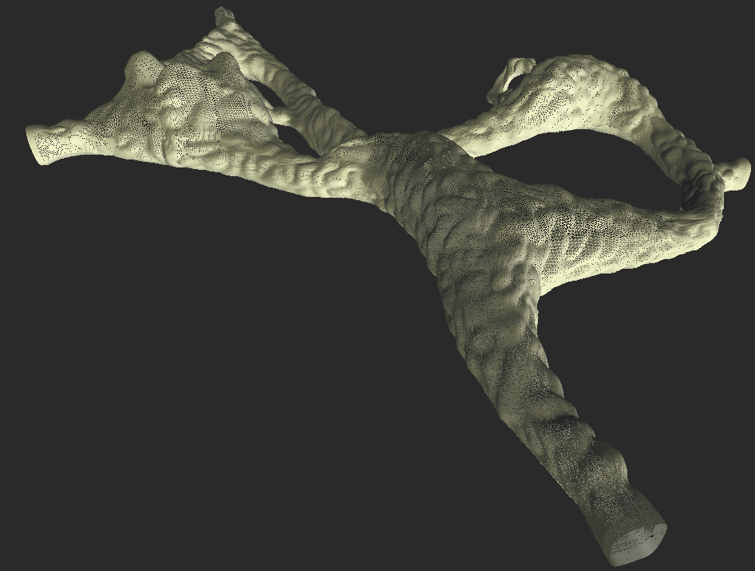
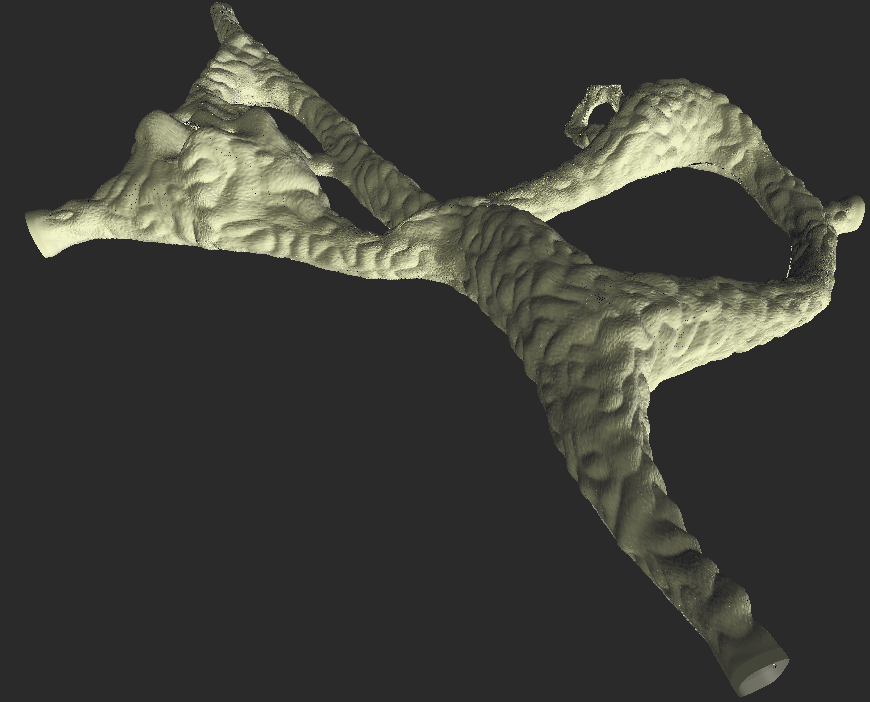
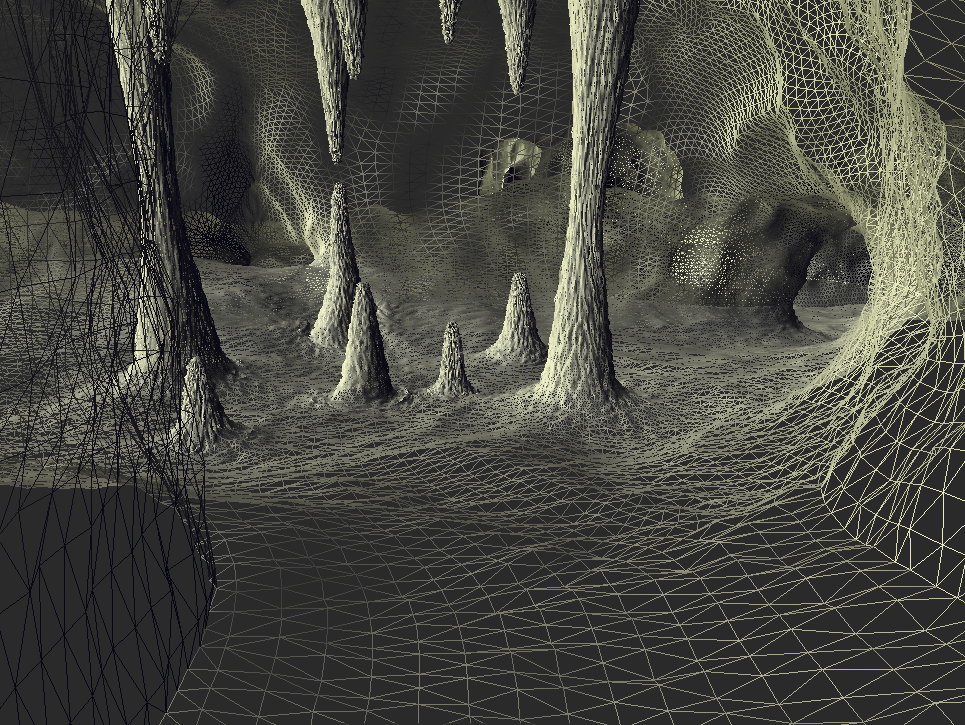

# Ribs

**Table of content**
<!-- TOC -->

- [Requirements](#requirements)
- [Installation](#installation)
- [Exporting to ply](#exporting-to-ply)
- [Interacting with the resulting geometries](#interacting-with-the-resulting-geometries)
- [The Cave](#the-cave)
  - [Different rendering tools](#different-rendering-tools)
  - [Triangulation vs point cloud](#triangulation-vs-point-cloud)
  - [The effect of the subdivision level on the geometry](#the-effect-of-the-subdivision-level-on-the-geometry)
- [TODO](#todo)

<!-- /TOC -->
---
A Blender based generator of tunnel systems and cave triangulations and point clouds  

Ribs is a mock up name for [Lyon fish-bones](./Doc/Lyon_Fish_Bones).



## Requirements
* Python > 3.10
* Blender version > 4.0.2

## Installation

```bash
cd Src
python3.10 -m venv venv
source venv/bin/activate
(venv) pip install -r requirements.txt
```

## Exporting to ply

```bash
python export_to_ply.py -h
python export_to_ply.py -v --subdivision 3 --grid_size_x 3 --grid_size_y 2
```

Open the resulting file (`cave_*.ply`) e.g. with `https://point.love/`

## Interacting with the resulting geometries

If you wish to interact with the resulting geometries with the help of the
blender UI (that is use commands of the form `blender --python <some_script.py>`),
and because of
[this issue](https://blender.stackexchange.com/questions/181928/does-blender-use-a-python-virtual-environment)
you will further need to define the following `PYTHONPATH` environnement 
variable
```bash
(venv) export PYTHONPATH=`pwd`:`pwd`/venv/lib/python3.10/site-packages
```

Using Blender UI with the constructed is achieved with e.g (**mind the 
additional " -- " argument**)
```bash
blender --python export_to_ply.py -- -v --subdivision 2
```

## The Cave

### Different rendering tools

<figure>
  
  <figcaption>MeshLab renderer on point cloud, subdivision=2, grid_size_x=3, grid_size_y=2</figcaption>
</figure>

<figure>
  
  <figcaption>Point.love renderer on point cloud, subdivision=2, grid_size_x=3, grid_size_y=2</figcaption>
</figure>

### Triangulation vs point cloud
<figure>
  
  <figcaption>Point cloud, subdivision=1</figcaption>
</figure>

<figure>
  
  <figcaption>Triangulation, subdivision=1</figcaption>
</figure>

<figure>
  
  <figcaption>Point cloud, subdivision=2</figcaption>
</figure>

<figure>
  
  <figcaption>Triangulation, subdivision=2</figcaption>
</figure>

### The effect of the subdivision level on the geometry

<figure>
  
  <figcaption>Triangulation, subdivision=1 (without color rendering)</figcaption>
</figure>

<figure>
  
  <figcaption>Triangulation, subdivision=2 (without color rendering)</figcaption>
</figure>

<figure>
  
  <figcaption>Triangulation, subdivision=3 (without color rendering)</figcaption>
</figure>

<figure>
  
  <figcaption>Triangulation, subdivision=4, with colors</figcaption>
</figure>

<figure>
  
  <figcaption>Triangulation, subdivision=4 (without color rendering)</figcaption>
</figure>

<figure>
  
  <figcaption>Triangulation, subdivision=4, with colors</figcaption>
</figure>

## TODO
* Try the `apply_modifiers=True` exporting option.