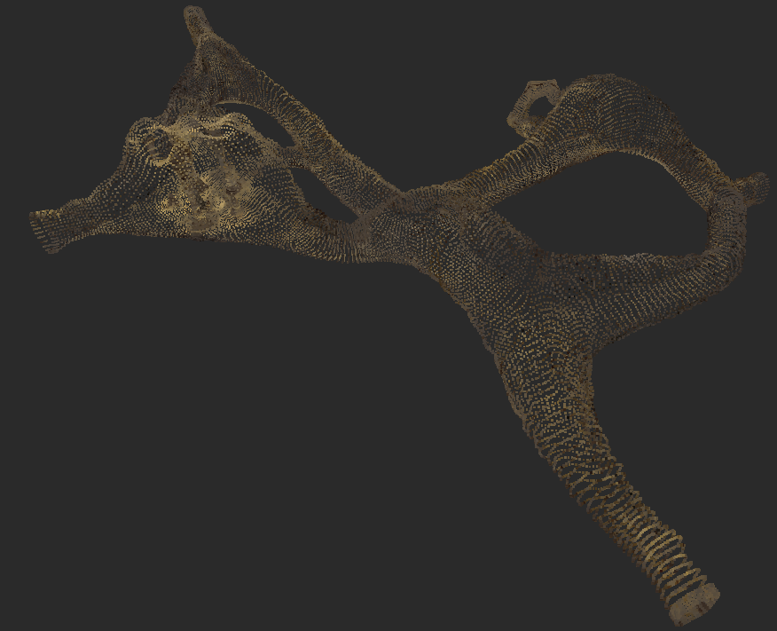

# Ribs

**Table of content**
<!-- TOC -->

- [Introduction](#introduction)
- [Ribs generator usage](#ribs-generator-usage)
  - [Technical elements](#technical-elements)
  - [Examples of usage](#examples-of-usage)
  - [Interacting through Blender with the resulting geometries](#interacting-through-blender-with-the-resulting-geometries)
- [The Cave system](#the-cave-system)
  - [The basic building block](#the-basic-building-block)
  - [Two types of geometrical outputs: triangulation and point cloud](#two-types-of-geometrical-outputs-triangulation-and-point-cloud)
  - [Modeling parameter: varying the stalactites length](#modeling-parameter-varying-the-stalactites-length)
  - [Modeling parameter: The effect of the subdivision level on the geometry](#modeling-parameter-the-effect-of-the-subdivision-level-on-the-geometry)
  - [Modeling parameter: composition into a grid system of caves](#modeling-parameter-composition-into-a-grid-system-of-caves)
- [The tunnel](#the-tunnel)
- [TODO](#todo)

<!-- /TOC -->

## Introduction

Ribs is a generator of both 2-manifold triangulations and point cloud 
geometrical data. Through a set of geometric/topological parameters, Ribs 
finely controls its synthetic results conceived as data tools for the study,
 evaluation and calibration of algorithms working on 3D triangulation and/or 
point cloud datasets.

Ribs uses the [Python wrappers](https://docs.blender.org/api/current/) of
[Blender's 3D modeling features](https://en.wikipedia.org/wiki/Blender_(software))
to generate two datasets illustrating two kinds of geometries:
 - a regular and human manufactured system of tunnels,
 - a less smooth/regular cave system.

In addition to the surface and point cloud data, Ribs also provides a path
dataset (a branched system of discrete 1D-lines) that is a manual approximation
of the
[topological skeleton](https://en.wikipedia.org/wiki/Topological_skeleton) 
of the tunnel/cave system.
Such skeleton can be used either for studying visualisation techniques
(how to constrain the camera exploring the tunnel/cave system to remain
"inside" the system?) or to study skeleton extraction algorithms.

Note: the repository name, Ribs, is a mock up name for 
[Lyon fish-bones](./Doc/Lyon_Fish_Bones)
that was a source of inspiration for the tunnel system part of the project.


## Ribs generator usage

### Technical elements

#### Supported file format

[PLY - Polygon File Format](https://en.wikipedia.org/wiki/PLY_(file_format))
(see also 
[Paul Bourke's PLY format definition](https://paulbourke.net/dataformats/ply/))
is the only file format supported by Ribs.

`PLY` was chosen because:
- it allows the representation of both 3D point clouds and/or triangulations,
- it is supported by many softwares among witch
[Point Cloud Library (PCL)](https://pointclouds.org/documentation/tutorials/pcd_file_format.html),
[Cloud Compare](https://en.wikipedia.org/wiki/CloudCompare#Input/Output),
[MeshLab](https://en.wikipedia.org/wiki/MeshLab#References)),
- its [ASCII](https://en.wikipedia.org/wiki/ASCII) representation (as opposed
  to binary formats) allows for a simple parsing.

#### Requirements
* Python > 3.10
* Blender version > 4.0.2

### Examples of usage

#### Installation

```bash
cd Src
python3.10 -m venv venv
source venv/bin/activate
(venv) pip install -r requirements.txt
```

#### Usage parameters

The flags and parameter arguments are document by the following command
```bash
python export_to_ply.py -h
```

As a quick summary of parameters acting on the topology/geometry:
* `--subdivision SUBDIVISION`
  
  The number of recursive
  [Catmull-Clark](https://en.wikipedia.org/wiki/Catmull%E2%80%93Clark_subdivision_surface)
  subdivisions that are applied to the original low-resolution surface prior
  to the triangularisation of the result. This parameter acts on the number
  of produced vertices/triangles. 

* `--grid_size_x GRID_SIZE_X` and `--grid_size_y GRID_SIZE_Y`
  
  The number of replications, along the `X` axis and along the `Y` axis 
  respectively, of the basic cave building block. Those parameter act on the
  topology (genus and number of boundaries) of the resulting gridified cave
  system and as such induces a higher number of vertices/triangles.   

Other parameters
* `--outputdir OUTPUTDIR`
  
  Target directory for the resulting PLY files.


#### Usage example
```bash
python export_to_ply.py -v --subdivision 3 --grid_size_x 3 --grid_size_y 2
```

Open the resulting file (`cave_*.ply`) e.g. with `https://point.love/`

### Interacting through Blender with the resulting geometries

If you wish to interact with the resulting geometries with the help of the
blender UI (that is use commands of the form `blender --python <some_script.py>`),
and because of
[this issue](https://blender.stackexchange.com/questions/181928/does-blender-use-a-python-virtual-environment)
you will further need to define the following `PYTHONPATH` environnement 
variable
```bash
(venv) export PYTHONPATH=`pwd`:`pwd`/venv/lib/python3.10/site-packages
```

Using Blender UI with the constructed is achieved with e.g (**mind the 
additional " -- " argument**)
```bash
blender --python export_to_ply.py -- -v --subdivision 2
```

## The Cave system

### The basic building block


### Two types of geometrical outputs: triangulation and point cloud

Ribs generates
<figure>
  
  <figcaption>Point cloud, subdivision=1</figcaption>
</figure>

<figure>
  
  <figcaption>Triangulation, subdivision=1</figcaption>
</figure>

<figure>
  
  <figcaption>Point cloud, subdivision=2</figcaption>
</figure>

<figure>
  
  <figcaption>Triangulation, subdivision=2</figcaption>
</figure>

### Modeling parameter: varying the stalactites length  

The vertices sitting at the top of the stalactites have been regrouped within
a "Change_size_stalactite" vertex group to which a `SimpleDeform` modifier,
configured in `Stretch` mode, is applied. 
<center><figure>
  
  <figcaption>Triangulation, subdivision=2</figcaption>
</figure></center>

Varying the `Factor` of this `Stretch` mode modifier changes the stalactite
height as depicted on the following pictures where the `StretchFactor` is
respectively `0`, `7`, `14` and `21`

<table>
  <tr>
    <td>
       
    </td>
    <td>
       
    </td>
  </tr>
  <tr>
    <td>
       
    </td>
    <td>
       
    </td>
  </tr>
</table>


### Modeling parameter: The effect of the subdivision level on the geometry

<figure>
  
  <figcaption>Triangulation, subdivision=1 (without color rendering)</figcaption>
</figure>

<figure>
  
  <figcaption>Triangulation, subdivision=2 (without color rendering)</figcaption>
</figure>

<figure>
  
  <figcaption>Triangulation, subdivision=3 (without color rendering)</figcaption>
</figure>

<figure>
  
  <figcaption>Triangulation, subdivision=4, with colors</figcaption>
</figure>

<figure>
  
  <figcaption>Triangulation, subdivision=4 (without color rendering)</figcaption>
</figure>

<figure>
  
  <figcaption>Triangulation, subdivision=4, with colors</figcaption>
</figure>

### Modeling parameter: composition into a grid system of caves

In order to generate datasets with ranging topologies and dataset sizes, Ribs
allows for the composition (the result is guaranteed to be a single 2-manifold
surface) of the basic building block into grids.

Here is an example of a 3x2 grid system of caves rendered with different tools 
(and point sizes).

<figure>
  
  <figcaption>MeshLab renderer on point cloud (subdivision=2, grid_size_x=3, grid_size_y=2)</figcaption>
</figure>

<figure>
  
  <figcaption>Point.love renderer on point cloud (subdivision=2, grid_size_x=3, grid_size_y=2)</figcaption>
</figure>

## The tunnel

## TODO
* add a CLI parameter controlling the stalactites stretch factor.

* Try the `apply_modifiers=True` exporting option.