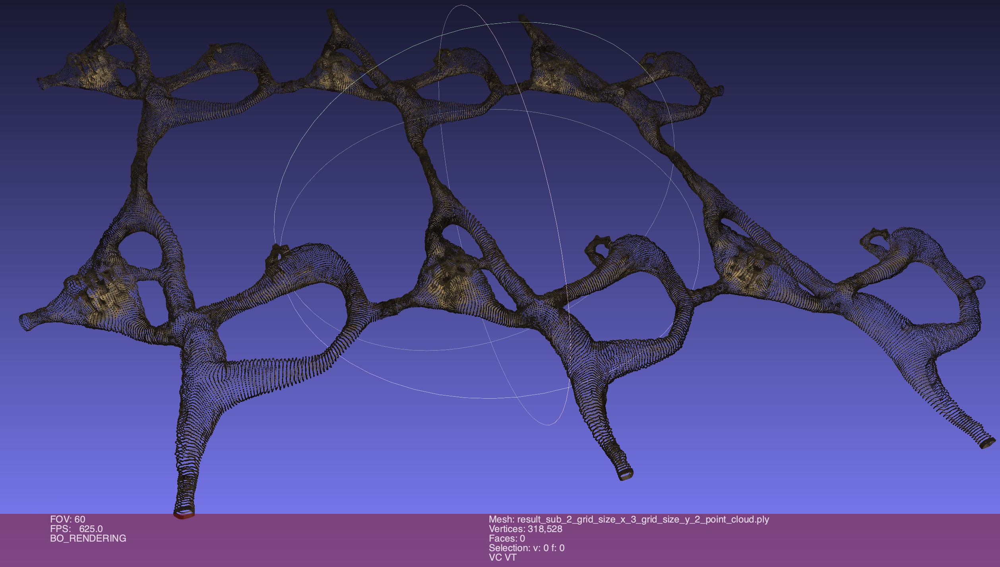

# Ribs<!-- omit from toc -->

## Table Of Content<!-- omit from toc -->

- [Introduction](#introduction)
- [Ribs generator usage](#ribs-generator-usage)
  - [Technical elements](#technical-elements)
    - [Supported file format](#supported-file-format)
    - [Requirements](#requirements)
  - [Examples of usage](#examples-of-usage)
    - [Installation](#installation)
    - [Usage parameters](#usage-parameters)
    - [Cave specific parameters](#cave-specific-parameters)
    - [Usage examples](#usage-examples)
  - [Interacting through Blender with the resulting geometries](#interacting-through-blender-with-the-resulting-geometries)
- [Illustrations of resulting Cave systems](#illustrations-of-resulting-cave-systems)
  - [The basic building block](#the-basic-building-block)
  - [Two types of geometrical outputs: triangulation and point cloud](#two-types-of-geometrical-outputs-triangulation-and-point-cloud)
  - [Modeling parameter: varying the stalactites length](#modeling-parameter-varying-the-stalactites-length)
  - [Inclusion of image](#inclusion-of-image)
  - [Modeling parameter: The effect of the subdivision level on the geometry](#modeling-parameter-the-effect-of-the-subdivision-level-on-the-geometry)
  - [Modeling parameter: composition into a grid system of caves](#modeling-parameter-composition-into-a-grid-system-of-caves)
- [Illustrations of resulting Tunnel systems](#illustrations-of-resulting-tunnel-systems)
  - [Dimensions/Sizes of resulting geometries](#dimensionssizes-of-resulting-geometries)
- [TODO](#todo)

## Introduction

Ribs is a generator of both 2-manifold triangulations and point cloud
geometrical data. Through a set of geometric/topological parameters, Ribs
finely controls its synthetic results conceived as data tools for the study,
evaluation and calibration of algorithms working on 3D triangulation and/or
point cloud datasets.

Ribs uses the [Python wrappers](https://docs.blender.org/api/current/) of
[Blender's 3D modeling features](<https://en.wikipedia.org/wiki/Blender_(software)>)
to generate two datasets illustrating two kinds of geometries:

- a regular and human manufactured system of tunnels,
- a less smooth/regular cave system.

In addition to the surface and point cloud data, Ribs also provides a path
dataset (a branched system of discrete 1D-lines) that is a manual approximation
of the
[topological skeleton](https://en.wikipedia.org/wiki/Topological_skeleton)
of the tunnel/cave system.
Such skeleton can be used either for studying visualisation techniques
(how to constrain the camera exploring the tunnel/cave system to remain
"inside" the system?) or to study skeleton extraction algorithms.

Note: the repository name, Ribs, is a mock up name for
[Lyon fish-bones](./Doc/Lyon_Fish_Bones)
that was a source of inspiration for the tunnel system part of the project.

## Ribs generator usage

### Technical elements

#### Supported file format

[PLY - Polygon File Format](<https://en.wikipedia.org/wiki/PLY_(file_format)>)
(see also
[Paul Bourke's PLY format definition](https://paulbourke.net/dataformats/ply/))
is the only file format supported by Ribs.

`PLY` was chosen because:

- it allows the representation of both 3D point clouds and/or triangulations,
- it is supported by many softwares among witch
  [Point Cloud Library (PCL)](https://pointclouds.org/documentation/tutorials/pcd_file_format.html),
  [Cloud Compare](https://en.wikipedia.org/wiki/CloudCompare#Input/Output),
  [MeshLab](https://en.wikipedia.org/wiki/MeshLab#References)),
- its [ASCII](https://en.wikipedia.org/wiki/ASCII) representation (as opposed
  to binary formats) allows for a simple parsing.

#### Requirements

- [Arch](https://en.wikipedia.org/wiki/Instruction_set_architecture): [amd64](https://en.wikipedia.org/wiki/X86-64). Note: this archirecture hard contraint is not due to RIBS per se (that is pure python code), but to its [bpy (blender python)](https://pypi.org/project/bpy/4.0.0/) dependency that [is implicitly arch dependent](https://projects.blender.org/blender/blender/issues/120181).
- Python > 3.10
- Blender version > 4.0.2

### Examples of usage

#### Installation

```bash
git clone https://github.com/VCityTeam/TT-Ribs.git  # This repository
cd TT-Ribs
```

```bash
cd Src
python3.10 -m venv venv
source venv/bin/activate
pip install -r requirements.txt
```

#### Usage parameters

The complete flag and parameter arguments are documented by the following commands

```bash
python Cave.py -h     # For the cave system
```

```bash
python Tunnel.py -h   # For the tunnel system
```

As a quick summary of shared (between the `Cave.py` and `Tunnel.py` scripts) and flags/parameters :

- `--subdivision SUBDIVISION`

  The number of recursive
  [Catmull-Clark](https://en.wikipedia.org/wiki/Catmull%E2%80%93Clark_subdivision_surface)
  subdivisions that are applied to the original low-resolution surface prior
  to the triangularisation of the result. This parameter acts on the number
  of produced vertices/triangles.

- `--outputdir OUTPUTDIR`

  Target directory for the resulting PLY files.

- `--fill_holes`

  By default, the produced surfaces (both Cave and Tunnel systems) have boundaries (their topology is the one of [genus-n surfaces](https://en.wikipedia.org/wiki/Genus_(mathematics)) with [punctures](https://en.wikipedia.org/wiki/Puncture_(topology))). Set the `--fill_holes` flag will plug/fill the holes/boundaries of the resulting surface (that will thus be puncture free).

- `--no-ply-export`
  
  Do not export to PLY files. (default: False)

- `--no-obj-export`

  Do not export to OBJ files. (default: False)

#### Cave specific parameters

In opposition to `Tunnel.py`, the `Cave.py` has a set of specific parameters that control its general topology (number of replicates of a basic build block) as well as some geometric features like the height of the stalactites. Here is a brief summary (refer to the output of `python Cave.py -h` for more details):  

- `--grid_size_x GRID_SIZE_X` and `--grid_size_y GRID_SIZE_Y`

  The number of replications along the `X` axis and along the `Y` axis
  respectively, of the basic cave building block (defaults are `1` meaning no replication). Those parameter act on the topology (genus and number of boundaries) of the resulting "gridified" cave system and as such induces a higher number of vertices/triangles.

- `--stalactite_factor STALACTITE_FACTOR`
  
  Vertical extension factor of the stalactites (default: -25.0)

#### Usage examples

```bash
python Tunnel.py --subdivision 3 --no-ply-export --fill_holes
```

```bash
python Cave.py -v --grid_size_x 2 --grid_size_y 3
```

The resulting files are of the form `cave_*.ply` or `cave_*.obj` respectively `tunnel_*.ply` or `tunnel_*.obj` and can be visualized with tools like e.g. [`https://point.love/`](point.love).

### Interacting through Blender with the resulting geometries

If you wish to interact with the resulting geometries with the help of the
blender UI (that is use commands of the form `blender --python <some_script.py>`),
and because of
[this issue](https://blender.stackexchange.com/questions/181928/does-blender-use-a-python-virtual-environment)
you will further need to define the following `PYTHONPATH` environnement
variable

```bash
export PYTHONPATH=`pwd`:`pwd`/venv/lib/python3.10/site-packages
```

Using Blender UI with the constructed is achieved with e.g.

```bash
blender --python Cave.py -- -v --subdivision 2
```

or

```bash
blender --python Tunnel.py -- -v --subdivision 2
```

> [!WARNING]
> In the above commands mind the additional " -- " argument that is not
> required when running "outside" of the blender UI.

## Illustrations of resulting Cave systems

### The basic building block


### Two types of geometrical outputs: triangulation and point cloud

Ribs generates the following results

<figure>
  
  <figcaption>Point cloud, subdivision=1</figcaption>
</figure>

<figure>
  
  <figcaption>Triangulation, subdivision=1</figcaption>
</figure>

<figure>
  
  <figcaption>Point cloud, subdivision=2</figcaption>
</figure>

<figure>
  
  <figcaption>Triangulation, subdivision=2</figcaption>
</figure>

With `grid_size_x = grid_size_y = 1`

| Subdivisions | # Vertices | #Edges | #Faces | Point Cloud | Triangulation | Time   |
| ------------ | ---------- | ------ | ------ | ----------- | ------------- | ------ |
| 1            | 12k        | 25k    | 12k    | 1.3Mb       | 1.7Mb         | 7"     |
| 2            | 50k        | 101k   | 50k    | 5Mb         | 7Mb           | 14"    |
| 3            | 202k       | 405k   | 202k   | 19Mb        | 28Mb          | 43"    |
| 4            | 810k       | 1 619k | 809k   | 77Mb        | 112Mb         | 3'00"  |
| 5            | 3 238k     | 6 476k | 3 237k | 305M        | 459M          | 11'46" |

### Modeling parameter: varying the stalactites length

The vertices sitting at the top of the stalactites have been regrouped within
a "Change_size_stalactite" vertex group to which a `SimpleDeform` modifier,
configured in `Stretch` mode, is applied.

<center><figure>
  
  <figcaption>Triangulation, subdivision=2</figcaption>
</figure></center>

Varying the `Factor` of this `Stretch` mode modifier changes the stalactite
height as depicted on the following pictures where the `StretchFactor` is
respectively `0`, `7`, `14` and `21`

<table>
  <tr>
    <td>
       
    </td>
    <td>
       
    </td>
  </tr>
  <tr>
    <td>
       
    </td>
    <td>
       
    </td>
  </tr>
</table>

### Inclusion of image

In order to test how the information conveyed by textured images get degraded from their original version to vertices color within triangulations (of various resolutions) the Cave integrates an image of "primitive wall paintings".
The following figure gives some clues of what remains available/recognizable for a level of subdivision of 3:

<figure>
  
  <figcaption>Point.love detail rendering of primitive wall paintings (subdivision=3)</figcaption>
</figure>

### Modeling parameter: The effect of the subdivision level on the geometry

<figure>
  
  <figcaption>Triangulation, subdivision=1 (without color rendering)</figcaption>
</figure>

<figure>
  
  <figcaption>Triangulation, subdivision=2 (without color rendering)</figcaption>
</figure>

<figure>
  
  <figcaption>Triangulation, subdivision=3 (without color rendering)</figcaption>
</figure>

<figure>
  
  <figcaption>Triangulation, subdivision=4, with colors</figcaption>
</figure>

<figure>
  
  <figcaption>Triangulation, subdivision=4 (without color rendering)</figcaption>
</figure>

<figure>
  
  <figcaption>Triangulation, subdivision=4, with colors</figcaption>
</figure>

### Modeling parameter: composition into a grid system of caves

In order to generate datasets with ranging topologies and dataset sizes, Ribs
allows for the composition (the result is guaranteed to be a single 2-manifold
surface) of the basic building block into grids.

Here is an example of a 3x2 grid system of caves rendered with different tools
(and point sizes).

<figure>
  
  <figcaption>MeshLab rendering of point cloud (subdivision=2, grid_size_x=3, grid_size_y=2)</figcaption>
</figure>

<figure>
  
  <figcaption>Point.love rendering of point cloud (subdivision=2, grid_size_x=3, grid_size_y=2)</figcaption>
</figure>

## Illustrations of resulting Tunnel systems

<figure>
  
  <figcaption>Point.love rendering (side view) of tunnel systems (subdivision=1)</figcaption>
</figure>

<figure>
  
  <figcaption>Point.love rendering (above view) of tunnel systems (subdivision=1)</figcaption>
</figure>

<figure>
  
  <figcaption>Point.love rendering (perspective view) of tunnel systems (subdivision=1)</figcaption>
</figure>

### Dimensions/Sizes of resulting geometries

| Subdivisions | # Vertices | #Edges | #Faces | Point Cloud | Triangulation | Time   |
| ------------ | ---------- | ------ | ------ | ----------- | ------------- | ------ |
| 1            | 35k        | 105K   | 70k    | 4.5Mb       | 5.8M          | 32"    |
| 2            | 140k       | 420k   | 280k   | 16Mb        | 21Mb          | 1'32"  |
| 3            | 560k       | 1 682k | 1 121k | 59Mb        | 83Mb          | 5'33"  |
| 4            | 2 243k     | 6 731k | 4 487k | 226Mb       | 331Mb         | 23'17" |

## TODO

- For Tunnel: document the existence of a wall painting (a group of three
  hunters) and its position within the cave.
- Document the existence and usage of `Density_test` object
- Document the existence and usage of `Path` object
- Try the `apply_modifiers=True` exporting option.
